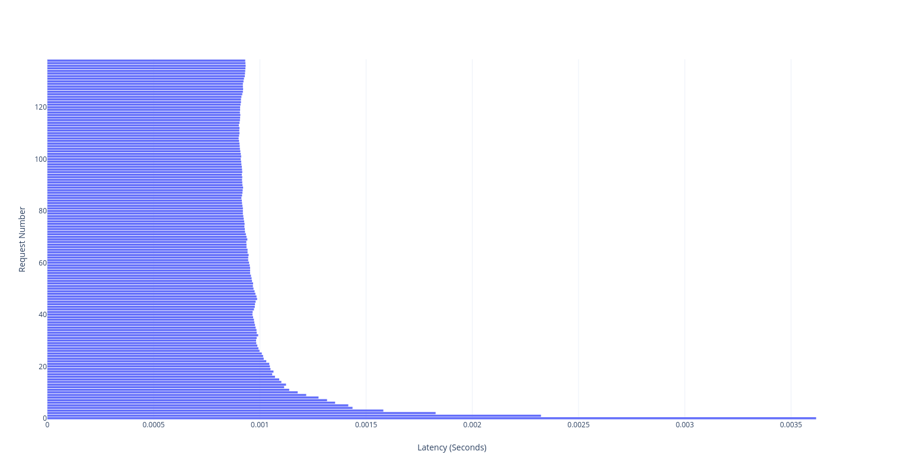
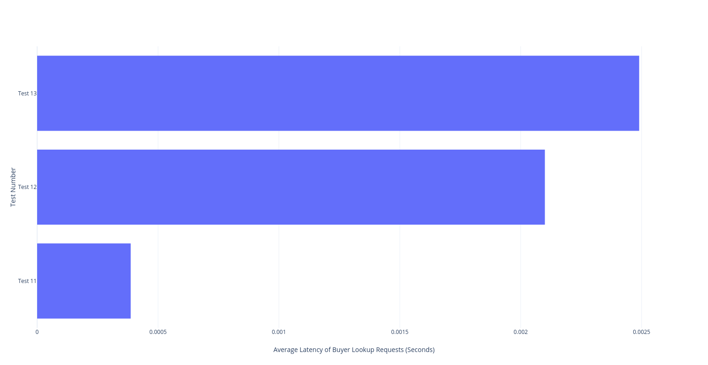

```{r setup, include=FALSE}
knitr::opts_chunk$set(cache=TRUE,
                      message=FALSE, warning=FALSE,
                      fig.path='figs/',
                      cache.path = '_cache/',
                      fig.process = function(x) {
                      x2 = sub('-\\d+([.][a-z]+)$', '\\1', x)
                      if (file.rename(x, x2)) x2 else x
                      })

defOut <- knitr::knit_hooks$get("plot")  # save the default plot hook 
knitr::knit_hooks$set(plot = function(x, options) {  # set new plot hook ...
  x <- defOut(x, options)  # first apply the default hook
  if(!is.null(options$wrapfigure)) {  # then, if option wrapfigure is given ...
    # create the new opening string for the wrapfigure environment ...
    wf <- sprintf("\\begin{wrapfigure}{%s}{%g\\textwidth}", options$wrapfigure[[1]], options$wrapfigure[[2]])
    x  <- gsub("\\begin{figure}", wf, x, fixed = T)  # and replace the default one with it.
    x  <- gsub("{figure}", "{wrapfigure}", x, fixed = T)  # also replace the environment ending
  }
  return(x)
})

library(DiagrammeR)
```


# Local Machine Deployment

In this test we deployed 6 peers on the local machine withe the following node configuration. The node configuation file can be found in `performance\per1config.yml`. The configuration can be run using `bash run.sh per1config.yml`.

nodes       address            role                sell                buy
--------    ----------------   ----------------    ----------------    ----------------
node0       localhost:10001    seller              salt (10)           N/A
node1       localhost:10002    buyer               N/A                 salt
node2       localhost:10004    none                N/A                 N/A
node3       localhost:10005    buyer               N/A                 salt
node4       localhost:10003    none                N/A                 N/A
node5       localhost:10000    seller              salt (unlimited)    N/A
---------   ----------------   ----------------    ----------------    ----------------

\noindent The network topology is as follows:

```{r echo=FALSE, dev='png', out.width="50%", fig.align='center'}
library("DiagrammeR")
grViz("
      digraph test {
        rankdir=LR;
        overlap = false;
        splines = true;
        node [shape = circle];
    
        0 -> 1 [arrowhead = none];
        0 -> 5 [arrowhead = none];
        1 -> 2 [arrowhead = none];
        1 -> 4 [arrowhead = none];
        2 -> 3 [arrowhead = none];
        2 -> 4 [arrowhead = none];
        3 -> 4 [arrowhead = none];
        4 -> 5 [arrowhead = none];
    }
 ")
```

\noindent Program Behavior: the program behaves as expected. Salt is never sold after `node0` sold all of is 10 salt. Salt is sold and restocked throughout for `node5`. The two nodes with `none` roles never participate in transactions but only relays the lookup requests.

# Remote Machine Deployment

In this test we deployed 6 peers on the local machine withe the following node configuration. The node configuration files can be found in the `performance\per1config.yml`. 

nodes       address                 role                sell                buy
--------    ---------------------   ----------------    ----------------    ----------------
node0       54.144.240.179:10001    seller              salt (10)           N/A
node1       54.172.102.164:10002    buyer               N/A                 salt
node2       34.202.157.206:10004    none                N/A                 N/A
node3       54.144.240.179:10005    buyer               N/A                 salt
node4       34.202.157.206:10003    none                N/A                 N/A
node5       54.172.102.164:10000    seller              salt (unlimited)    N/A
---------   ---------------------   ----------------    ----------------    ----------------

\noindent The network topology is as follows:

```{r echo=FALSE, dev='png', out.width="50%", fig.align='center'}
library("DiagrammeR")
grViz("
      digraph test {
        rankdir=LR;
        overlap = false;
        splines = true;
        node [shape = circle];
    
        0 -> 1 [arrowhead = none];
        0 -> 5 [arrowhead = none];
        1 -> 2 [arrowhead = none];
        1 -> 4 [arrowhead = none];
        2 -> 3 [arrowhead = none];
        2 -> 4 [arrowhead = none];
        3 -> 4 [arrowhead = none];
        4 -> 5 [arrowhead = none];
    }
 ")
```

\noindent Results for 500 invocations:

nodes       address                 Remote RPC Latency (s)    Local RPC Latency (s)
--------    ---------------------   ----------------------    ---------------------
node0       54.144.240.179:10001    0.000818                  0.000362
node1       54.144.240.179:10002    0.000673                  0.000210
node2       34.202.157.206:10004    0.000767                  0.000115
node3       54.144.240.179:10005    0.000549                  0.000265
node4       34.202.157.206:10003    0.000778                  0.000178
node5       54.172.102.164:10000    0.000690                  0.000359
---------   ---------------------   ----------------------    ---------------------

\noindent Conclusion: Local RPC Lantency is much lower than Remote RPC Latency

# Performance of Client Search Requests

Configuration is the same as above. We look at the lookup performance logs of the buyer nodes `node1` and its sequential respond time of 140 lookup calls. The numbers were limited because of how we structure the script to time out after a certain amount of time for all machines to run the next test.



\noindent The minimum response time was 0.000900 seconds and the maximum response time was 0.003618 seconds. It also appears that lookup was had a higher latency in the beginning. This was probably because of the existence of a extra seller in the beginning of the network. After only one seller was left, the latency became more fixed.

# Performance of Concurrent Requests

In this performance evaluation we hardcode the network to have a singer seller with varying amount of buyers. The seller is on one machine and all the other buyers are on the other. The buyers are not connected to each other. A example network topology looks like the one below:

```{r echo=FALSE, dev='png', out.width="50%", fig.align='center'}
library("DiagrammeR")
grViz("
      digraph test {
        overlap = false;
        splines = true;
        node [shape = circle];
    
        0 -> 1 [arrowhead = none];
        0 -> 2 [arrowhead = none];
        0 -> 3 [arrowhead = none];
        0 -> 4 [arrowhead = none];
    }
 ")
```

\noindent The tests can be found in `tests\test11config.yml`, `tests\test12config.yml` and `tests\test13.yml`, with 3, 4, and 5 buyers respectively. Below is the data we collected for the average response time for each buyer depending on how many buyers is connected to the seller node. All of the data are measured in seconds. In test 11, the seller node is `node3`. In test 12 the seller node is `node4` and in test 13 the seller node is `node5`.


nodes               3 buyers                4 buyers                  5 buyers
-----------------   ---------------------   ----------------------    ---------------------
node0               0.000399                0.00210                   0.00263
node1               0.000411                0.00211                   0.00233
node2               0.000353                0.00210                   0.00275
node3               0.000174                0.00209                   0.00219
node4                                       0.000791                  0.00255
node5                                                                 0.000843
average of buyers   0.000387                0.00210                   0.00249
-----------------   ---------------------   ----------------------    ---------------------



\noindent From these numerical results, we can say that the response time increases when the seller receives increasing amount of concurrent requests from buyers. The seller response time also increased significantly as well. We would like to have tested more complex network topologies but we ran out of time. 

<!--
# References
\setlength{\parindent}{-0.2in}
\setlength{\leftskip}{0.2in}
\setlength{\parskip}{8pt}
\vspace*{-0.2in}
\noindent
-->
